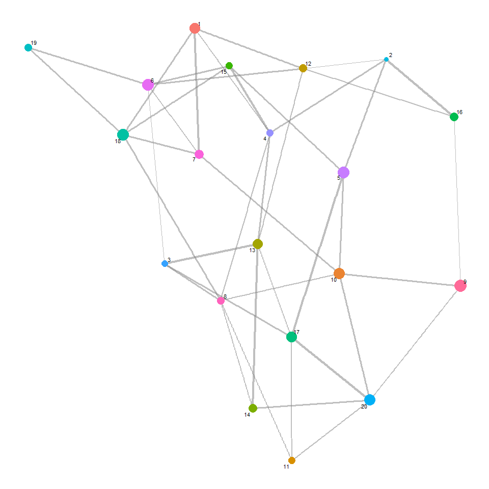
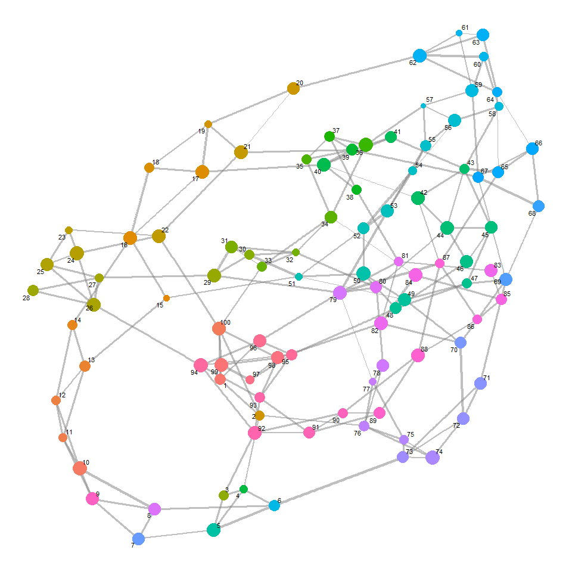
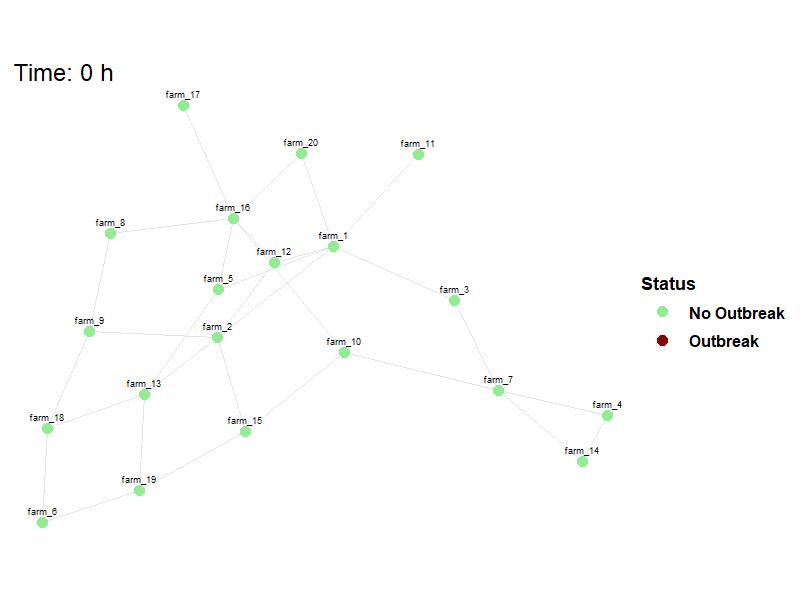

Between-Farm Transmission
================

- <a href="#description" id="toc-description">Description</a>
- <a href="#challengeabm-package"
  id="toc-challengeabm-package">challengeABM Package</a>
- <a href="#read-configuration-file" id="toc-read-configuration-file">Read
  Configuration File</a>
- <a href="#generate-network" id="toc-generate-network">Generate
  Network</a>
- <a href="#run-simulation" id="toc-run-simulation">Run Simulation</a>
- <a href="#extract-stats" id="toc-extract-stats">Extract Stats</a>
- <a href="#animation" id="toc-animation">Animation</a>

## Description

The **challengeABM** package includes the *simulate_net_model()*
function that accepts a networkis calibrated to exhibit the same
within-host virus dynamics as the *simulate_room_to_room()* function
uses for laboratory based animal experiments. At simulation start,
cattle (agents) are populated to a common area with a specified number
of FMDV infected individuals. On simulation hour 1, cattle begin making
random contact with each other at a specified hourly rate to show
homogeneous mixing.

Depending on the quantity of virus in the donor cattle and chance
contacts, they may or may not infect others. The quantity of virus in
nasal passages and in blood serum has been calibrated to match the
experimental study described in the analysis with parameters recorded in
the default_herd_config.yaml configuration file that is available with
this script.

## challengeABM Package

<details open>
<summary>Hide code</summary>

``` r
# library(remotes)
# remotes::install_github("geoepi/challengeABM")

library(challengeABM)
```

</details>

## Read Configuration File

<details open>
<summary>Hide code</summary>

``` r
config_file <- read_yaml(here("config/base_config_fmdv.yaml"))
```

</details>

## Generate Network

The *generate_farm_network()* function is used to create a graph network
representing the spatial relationships between farms and number of
cattle in each. Nodes in the network represent farms and edges are
proportional to the distance between those farms. The returned *list()*
includes a randomized `$graph` network object and a `$farm_df` data
frame with the farm labels and cattle number.

Using parameters in the configuration file:

Randomized spatial arrangement

<details open>
<summary>Hide code</summary>

``` r
net <- generate_farm_network(config_file)

plot_base_network(net$graph)
```

</details>



Randomized number of cattle

<details open>
<summary>Hide code</summary>

``` r
# dimensions
dim(net$farm_df)
```

</details>

    [1] 20  3

<details open>
<summary>Hide code</summary>

``` r
# peek at data
head(net$farm_df)
```

</details>

      farm_id node_id herd_size
    1  farm_1       1       377
    2  farm_2       2       207
    3  farm_3       3       219
    4  farm_4       4       234
    5  farm_5       5       447
    6  farm_6       6       447

<details open>
<summary>Hide code</summary>

``` r
# cattle numbers
range(net$farm_df$herd_size)
```

</details>

    [1] 207 468

Or alternatively using overrides:

<details open>
<summary>Hide code</summary>

``` r
net_2 <- generate_farm_network(config_file,
                               n_farms = 100,
                               graph_type = "smallworld",
                               herd_size_range = c(1000, 5000),
                               seed = 12345)

plot_base_network(net_2$graph)
```

</details>



<details open>
<summary>Hide code</summary>

``` r
# dimensions
dim(net_2$farm_df)
```

</details>

    [1] 100   3

<details open>
<summary>Hide code</summary>

``` r
# peek at data
head(net_2$farm_df)
```

</details>

      farm_id node_id herd_size
    1  farm_1       1      2881
    2  farm_2       2      2152
    3  farm_3       3      2270
    4  farm_4       4      1432
    5  farm_5       5      4383
    6  farm_6       6      2880

<details open>
<summary>Hide code</summary>

``` r
# cattle numbers
range(net_2$farm_df$herd_size)
```

</details>

    [1] 1043 4955

## Run Simulation

The *simulate_net_model()* functions accepts the network and disease
parameters from the config file and runs the simulation. This
parameterization takes 3-5 minutes to run, therefore a copy is saved for
reload.

<details open>
<summary>Hide code</summary>

``` r
model_result <- simulate_net_model(net, config_file)

saveRDS(model_result, here("local/demo/model_result_2025-06-13.rds"))
```

</details>

Download saved copy from OSF

<details open>
<summary>Hide code</summary>

``` r
osf_id <- osf_project_demo %>%
  osf_ls_files() %>%
  filter(name == "model_result_2025-06-13.rds") # file to download

osf_download(osf_id,
             path = here("local/temp"), # where to save
             conflicts = "overwrite")
```

</details>

    # A tibble: 1 × 4
      name                        id                       local_path   meta        
      <chr>                       <chr>                    <chr>        <list>      
    1 model_result_2025-06-13.rds 684cbc31fea3288c3ab687ad D:/Github/c… <named list>

<details open>
<summary>Hide code</summary>

``` r
# read save file to environment
model_result <- readRDS(here("local/temp/model_result_2025-06-13.rds"))
```

</details>

Examine returned object. The returned object is a nested list, with
dataframes for each farm and animal at each time step.

<details open>
<summary>Hide code</summary>

``` r
length(model_result)
```

</details>

    [1] 3

<details open>
<summary>Hide code</summary>

``` r
names(model_result)
```

</details>

    [1] "farm_status"    "movement_log"   "quarantine_log"

<details open>
<summary>Hide code</summary>

``` r
names(model_result$farm_status)
```

</details>

    [1] "herd_agents" "herd_states" "quarantined"

<details open>
<summary>Hide code</summary>

``` r
names(model_result$farm_status$herd_agents)
```

</details>

     [1] "farm_1"  "farm_2"  "farm_3"  "farm_4"  "farm_5"  "farm_6"  "farm_7" 
     [8] "farm_8"  "farm_9"  "farm_10" "farm_11" "farm_12" "farm_13" "farm_14"
    [15] "farm_15" "farm_16" "farm_17" "farm_18" "farm_19" "farm_20"

<details open>
<summary>Hide code</summary>

``` r
names(model_result$farm_status$herd_agents$farm_1)
```

</details>

     [1] "id"                              "infection_status"               
     [3] "infect_agent"                    "is_donor"                       
     [5] "virus_nasal"                     "virus_serum"                    
     [7] "score_t"                         "nasal_threshold"                
     [9] "serum_threshold"                 "infect_threshold"               
    [11] "dose"                            "infectious_t"                   
    [13] "growth_rate_nasal"               "growth_rate_serum"              
    [15] "clearance_rate"                  "stochastic_noise"               
    [17] "exponential_factor"              "inflection_point_nasal"         
    [19] "inflection_point_serum"          "inflection_point_absolute_nasal"
    [21] "inflection_point_absolute_serum" "growth_cease"                   
    [23] "nasal_ccap"                      "serum_ccap"                     
    [25] "infection_time"                  "score"                          
    [27] "recovery_time"                   "has_recovered"                  
    [29] "infector_id"                     "preclin_onset"                  
    [31] "preclin_dur"                     "clinical_dur"                   
    [33] "transmitter_state"               "time_since_infection"           
    [35] "state"                          

## Extract Stats

Pulling a few statistics from the simulation using
*extract_net_simulation_summary()*. Note that functions such as
*calculate_R0_from_network()* are available to calculate stats from a
series of literately run models.

Basic stats:  
- R_farm: Farm-level reproduction estimated by outgoing node edges in
network.  
- outbreak_farms: Total number of farms with outbreaks in this demo
simulation.  
- first_infection_time: Time when first infection was detected.  
- total_infected_at_first: Total animals infected at time first animal
was detected (i.e., some undetected).  
- total_infected_animals: Total infected animals over course of
outbreak.

<details open>
<summary>Hide code</summary>

``` r
extract_net_simulation_summary(model_result)
```

</details>

    # A tibble: 1 × 5
      R_farm outbreak_farms first_infection_time total_infected_at_first
       <dbl>          <int>                <dbl>                   <int>
    1   3.29             14                   14                       2
    # ℹ 1 more variable: total_infected_animals <int>

## Animation

Viewing between farm disease spread.

<details open>
<summary>Hide code</summary>

``` r
animate_spread(net=net,
               farm_states = model_result$farm_status$herd_states, 
               move_df = dplyr::bind_rows(model_result$movement_log),
               output_file = here("images/spread.gif")
               )
```

</details>
<details open>
<summary>Hide code</summary>

``` r
knitr::include_graphics(here("images/spread.gif"))
```

</details>


