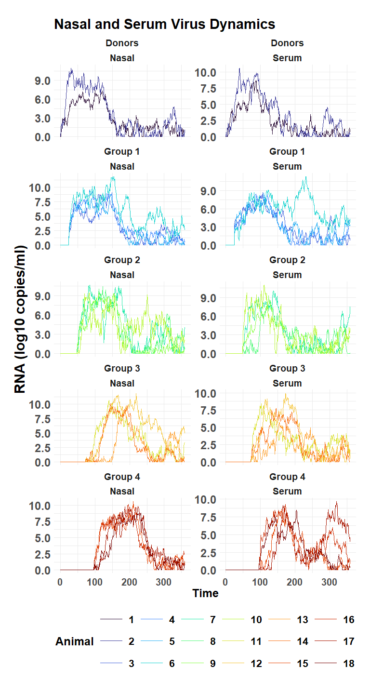
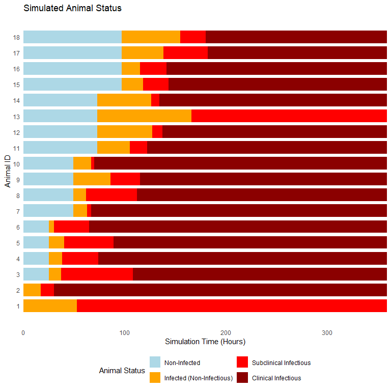

challengeABM: Room-to-Room Transmission
================

- <a href="#description" id="toc-description">Description</a>
- <a href="#load-challengeabm" id="toc-load-challengeabm">Load
  challengeABM</a>
- <a href="#run-the-simulation" id="toc-run-the-simulation">Run the
  simulation</a>
- <a href="#within-host-dynamics"
  id="toc-within-host-dynamics">Within-Host Dynamics</a>
- <a href="#status-of-individual-animals"
  id="toc-status-of-individual-animals">Status of Individual Animals</a>
- <a href="#iterate" id="toc-iterate">Iterate</a>

## Description

The **challangeABM** package includes the *simulate_room_to_room()*
function for simulating virus transmission between 18 head of cattle. At
simulation start, cattle (agents) are divided among five isolated rooms,
with two donor cattle in Room 1, and four cattle in each of the other
rooms, Rooms 2-5. On simulation hour 1, the two donor cattle are
inoculated by a virus. The donor cattle remain isolated from other
cattle for a 24hr period, then at the 24hr mark, the donor cattle (now
infected) are moved to Room 2. At the next 24hr interval (48 hours since
start of simulation), the donor cattle leave Room 2 and proceed to Room
3, where they remain for a 24hr period. The process continues with
donors moving to Room 4 at 72hrs and Room 5 at 96hrs.

Depending on the quantity of virus in the donor cattle, they may or may
not infect others. The quantity of virus in nasal passages and in blood
serum has been calibrated to replicate like Foot-and-Mouth Disease Virus
(FMDV).

The status of individual cattle virus loads, clinical presentation, and
other factors are recorded on an hourly basis.

Virus and cattle parameters may be specified in configuration files to
simulate changes to infectivity and virulence. Eventually,
*simulate_room_to_room()* will be updated to allow changes in time
intervals (minutes, hours, days,…), the number of rooms, and the number
of animals in each room.

## Load challengeABM

<details open>
<summary>Hide code</summary>

``` r
library(challengeABM)
```

</details>

## Run the simulation

First, set random seed for reproducible runs.

<details open>
<summary>Hide code</summary>

``` r
seed_val <- round(runif(1, 100, 300),0)
seed_val 
```

</details>

    [1] 117

<details open>
<summary>Hide code</summary>

``` r
set.seed(seed_val)
```

</details>

Run the simulation based using a configuration file with needed
parameters..

<details open>
<summary>Hide code</summary>

``` r
model_result <- simulate_room_to_room(here("config/default_R2R_config.yaml"))
```

</details>

## Within-Host Dynamics

View change in nasal and virus quantities within individual animals.

<details open>
<summary>Hide code</summary>

``` r
plot_virus_loads_R2R(model_result)
```

</details>



## Status of Individual Animals

View the disease status of individual animals.

<details open>
<summary>Hide code</summary>

``` r
plot_animal_status(model_result)
```

</details>



## Iterate

Additional function for multiple iterations.

<details open>
<summary>Hide code</summary>

``` r
iterate_R2R(simulate_room_to_room, # function
            config_file = here("config/default_R2R_config.yaml"), # settings to run
            num_iterations = 1000, # total iterations
            write_interval = 50, # write to csv every write_interval
            output_directory = here("local/test") # where to write
)
```

</details>
