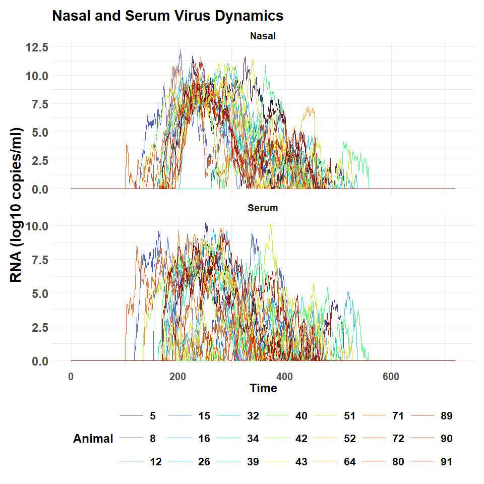
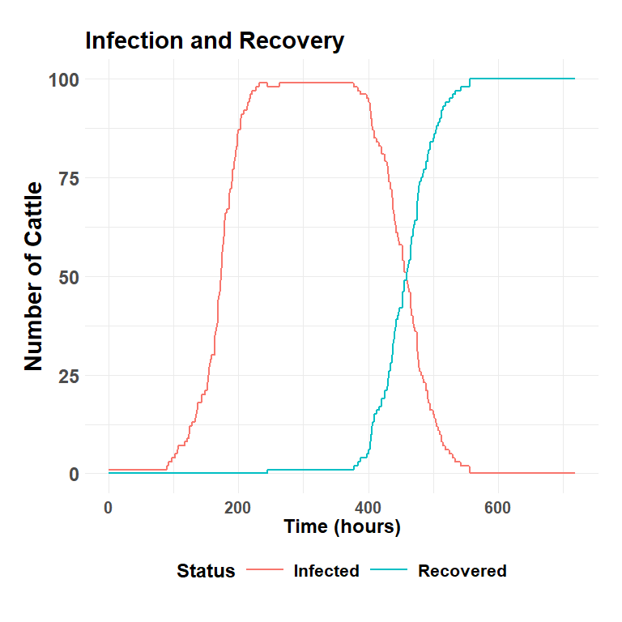

challengeABM: Within Herd Transmission
================

- <a href="#description" id="toc-description">Description</a>
- <a href="#load-challengeabm" id="toc-load-challengeabm">Load
  challengeABM</a>
- <a href="#run-the-simulation" id="toc-run-the-simulation">Run the
  simulation</a>
- <a href="#within-host-dynamics"
  id="toc-within-host-dynamics">Within-Host Dynamics</a>
- <a href="#herd-outbreak-curve" id="toc-herd-outbreak-curve">Herd
  Outbreak Curve</a>

## Description

The **challangeABM** package includes the *simulate_within_herd()*
function that is calibrated to exhibit the within host virus dynamics as
the *simulate_room_to_room()* function uses for laboratory based animal
experiments. At simulation start, cattle (agents) are populated to a
common area with a specified number of FMDV infected individuals. On
simulation hour 1, cattle begin making random contact with each other at
a specified hourly rate to show homogeneous mixing. Depending on the
quantity of virus in the donor cattle at the time of contact, they may
or may not infect others. The quantity of virus in nasal passages and in
blood serum has been calibrated to replicate like Foot-and-Mouth Disease
Virus (FMDV).

The status of individual cattle virus loads, clinical presentation, and
other factors are recorded on an hourly basis.

Virus and cattle parameters may be specified in configuration files to
simulate changes to infectivity and virulence.

## Load challengeABM

<details open>
<summary>Hide code</summary>

``` r
library(challengeABM)
```

</details>

## Run the simulation

First, set random seed for reproducible runs.

<details open>
<summary>Hide code</summary>

``` r
seed_val <- round(runif(1, 100, 300),0)
seed_val 
```

</details>

    [1] 119

<details open>
<summary>Hide code</summary>

``` r
set.seed(seed_val)
```

</details>

Run the simulation based using a configuration file with needed
parameters..

<details open>
<summary>Hide code</summary>

``` r
model_result <- simulate_within_herd(here("config/default_herd_config.yaml"))
```

</details>

## Within-Host Dynamics

Randomly select 21 animals.

<details open>
<summary>Hide code</summary>

``` r
plot_individual_virus_loads(model_result, sample_n = 21)
```

</details>



## Herd Outbreak Curve

Compare the number of infected and recovered individuals.

<details open>
<summary>Hide code</summary>

``` r
plot_herd_curve(model_result)
```

</details>


